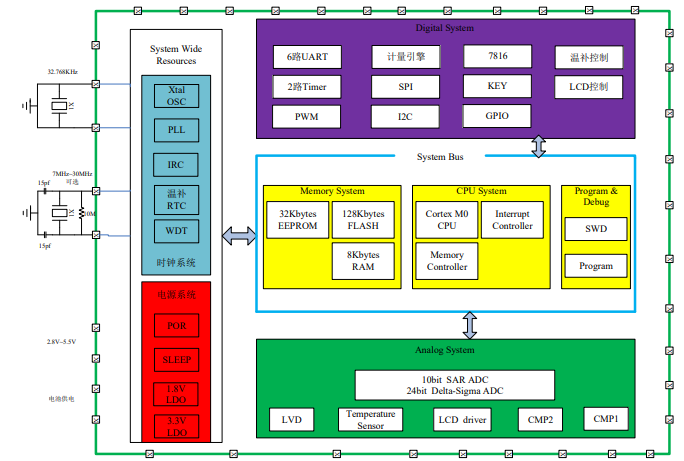

# [RN8213](https://github.com/SoCXin/RN8213)

#### [Vendor](https://github.com/SoCXin/Vendor)：[RN](http://www.renergy-me.cn/cn/index.php)
#### [Core](https://github.com/SoCXin/Cortex)：[Cortex M0](https://github.com/SoCXin/CM0)
#### [Level](https://github.com/SoCXin/Level)：29.4812MHz

[RN8213](https://github.com/SoCXin/RN8213)集成 32bit ARM Cortex-M0、计量模块、硬件温补 RTC、 LCD 控制器、EEPROM

* 128Kbytes FLASH (8Kbytes SRAM)，擦写次数 10 万次，数据保持时间大于 20 年
* 32Kbytes EEPROM，擦写次数 100 万次，支持 WORD 编程
* 保证计量精度的电压范围为2.8V~5.5V
* 典型工作频率为 3.6864MHz（最高可达 29.4912MHz）
* 单相智能表计应用时典型功耗约为 3.5mA,系统工作在 32Khz 下功耗约为 16μA,睡眠模式下芯片整体功耗约为 6μA.
* 在 5000:1 动态范围内有功误差小于 0.1%,计量参考基准温度系数典型值为 5ppm
* RTC 在-25℃ ~70℃内秒脉冲误差小于±5ppm，最小校正刻度为 0.068ppm

#### 关键特性

* 单相SoC芯片，在 5000:1 动态范围内有功计量及无功计量误差小于 0.1%
* 32KBytes EEPROM (100万次擦写)
* 计量参考基准温度系数典型值为 5ppm
* RTC 在-25℃ ~70℃内秒脉冲误差小于±5ppm，最小校正刻度为 0.068ppm
* 支持零线和火线双通道有功电能、无功电能、视在电能同时计量

### [资源收录](https://github.com/SoCXin/RN8213)

* [参考文档](docs/)
* [参考资源](src/)
* [参考工程](project/)

### [选型建议](https://github.com/SoCXin)

电能计量SoC在售相关

* [RN8213](https://github.com/SoCXin/RN8213)
* [HT5027](https://github.com/SoCXin/HT5027)

###  [www.SoC.xin(芯)](http://www.SoC.Xin)
